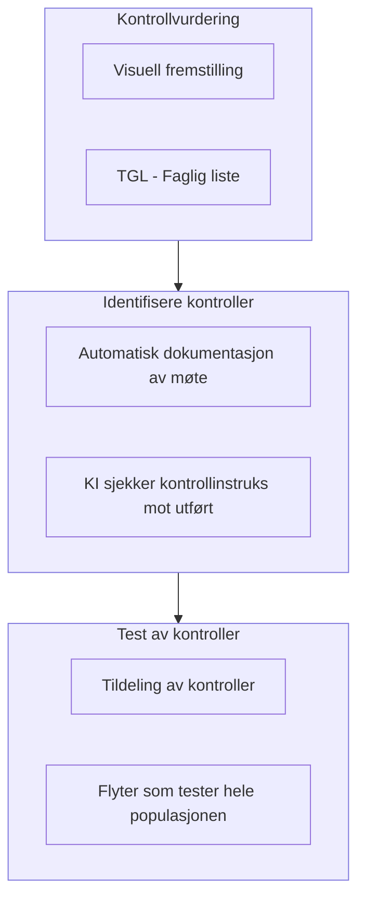

# Revisjonsprosess – Mermaid diagrammer for Miro

## Oversikt (lim dette inn i Miro Mermaid-app)

```mermaid
flowchart TB
    subgraph P1["🔵 Fase 1: Planlegging"]
        direction TB
        P1A[Oppdragsvurdering<br/>10 oppgaver]
        P1B[Engasjementsbrev<br/>2 oppgaver]
        P1C[Kontroller ekst. regnskapsfører<br/>1 oppgave]
        P1D[Innledende analyse<br/>1 oppgave]
        P1E[Kontroll IB<br/>1 oppgave]
        P1F[Kontroll skatteoppgjør<br/>1 oppgave]
        P1G[Enhetens oppbygging<br/>2 oppgaver]
        P1H[Eksterne forhold<br/>1 oppgave]
        P1I[Interne forhold<br/>4 oppgaver]
        P1J[Vesentlighetsgrense<br/>2 oppgaver]
        P1K[Angrepsvinkel<br/>1 oppgave]
        P1L[Risikooversikt<br/>1 oppgave]
        P1M[Egendefinerte aktiviteter<br/>1 oppgave]
        P1N[Kommunikasjon med kunde<br/>1 oppgave]

        P1A --> P1B --> P1C --> P1D
        P1D --> P1E --> P1F
        P1F --> P1G --> P1H --> P1I
        P1I --> P1J --> P1K --> P1L
        P1L --> P1M --> P1N
    end

    subgraph P2["🟣 Fase 2: Kontrollvurdering"]
        direction TB
        P2A[Kontrollvurdering<br/>2 oppgaver]
        P2B[Identifisere kontroller<br/>2 oppgaver]
        P2C[Test av kontroller<br/>2 oppgaver]
        P2D[Egendefinerte aktiviteter<br/>1 oppgave]

        P2A --> P2B --> P2C --> P2D
    end

    subgraph P3["🟢 Fase 3: Substanshandlinger"]
        direction TB
        P3A[Salgsinntekter<br/>6 oppgaver]
        P3B[Varekostnad<br/>3 oppgaver]
        P3C[Lønn<br/>4 oppgaver]
        P3D[Avskrivninger / driftsmidler<br/>1 oppgave]
        P3E[ADK<br/>2 oppgaver]
        P3F[Finansinntekter/-kostnader<br/>2 oppgaver]
        P3G[Skattekostnad<br/>2 oppgaver]
        P3H[Fast eiendom<br/>1 oppgave]
        P3I[Maskiner og anlegg<br/>2 oppgaver]
        P3J[Inventar og driftsløsøre<br/>4 oppgaver]
        P3K[Investeringer aksjer<br/>2 oppgaver]
        P3L[Obligasjoner / fordringer<br/>1 oppgave]
        P3M[Varelager<br/>5 oppgaver]
        P3N[Kundefordringer<br/>4 oppgaver]
        P3O[Markedsbaserte aksjer<br/>3 oppgaver]
        P3P[Bank, EK, gjeld<br/>7 oppgaver]
        P3Q[Skyldige off. avgifter<br/>3 oppgaver]
        P3R[Øvrig kortsiktig / IB<br/>3 oppgaver]
        P3S[Nærstående / internprising<br/>3 oppgaver]
        P3T[Egendefinerte aktiviteter<br/>6 oppgaver]

        P3A --> P3B --> P3C --> P3D
        P3D --> P3E --> P3F --> P3G
        P3G --> P3H --> P3I --> P3J
        P3J --> P3K --> P3L --> P3M
        P3M --> P3N --> P3O --> P3P
        P3P --> P3Q --> P3R --> P3S --> P3T
    end

    subgraph P4["🟠 Fase 4: Avslutning"]
        direction TB
        P4A[Forespørsel til advokat<br/>1 oppgave]
        P4B[Fortsatt drift<br/>1 oppgave]
        P4C[Hendelser etter balansedagen<br/>1 oppgave]
        P4D[Ikke-korrigerte feil<br/>1 oppgave]
        P4E[Fullstendighetserklæring<br/>1 oppgave]
        P4F[Skattemelding<br/>5 oppgaver]
        P4G[Årsregnskap<br/>3 oppgaver]
        P4H[Revisjonsberetning<br/>1 oppgave]
        P4I[Egendefinerte aktiviteter<br/>8 oppgaver]

        P4A --> P4B --> P4C --> P4D
        P4D --> P4E --> P4F --> P4G
        P4G --> P4H --> P4I
    end

    P1 --> P2 --> P3 --> P4

    style P1 fill:#E6F1FB,stroke:#378ADD,color:#042C53
    style P2 fill:#EEEDFE,stroke:#7F77DD,color:#26215C
    style P3 fill:#E1F5EE,stroke:#1D9E75,color:#04342C
    style P4 fill:#FAEEDA,stroke:#BA7517,color:#412402
```

---

## Fase 1: Planlegging – Detaljert

```mermaid
flowchart TB
    subgraph OV["Oppdragsvurdering"]
        OV1[API - Hente fjorårets regnskapstall]
        OV2[Meltwater - Nyhetsartikler om selskap]
        OV3[Automatisk google-sjekk av kunde]
        OV4[Reelle rettighetshavere inn i Decartes]
        OV5[Oppslag revisjonsanmerkninger]
        OV6[AML - Felles verktøy]
        OV7[Sjekk uavhengighet og konflikt]
        OV8[Automatisk analyse av drift]
        OV9[Utvidet egenerklæring fra kunde]
        OV10[Felles datamotor på tvers av Klar]
    end

    subgraph EB["Engasjementsbrev"]
        EB1[Kontaktinfo styreleder]
        EB2[Auto oppsett og arkivering engasjementbrev]
    end

    subgraph KR["Kontroller ekst. regnskapsfører"]
        KR1[API virksomhetsregister og Finanstilsynet]
    end

    subgraph IA["Innledende analyse"]
        IA1[Automatisk bransjespesifikk analyse]
    end

    subgraph KIB["Kontroll IB"]
        KIB1[Hente saldobalanse og sammenligne]
    end

    subgraph KS["Kontroll skatteoppgjør"]
        KS1[Hente skattemelding og sammenligne]
    end

    subgraph EO["Enhetens oppbygging"]
        EO1[Kartlegging kontroller - mislighetsrisiko]
        EO2[Automatisk virksomhetsbeskrivelser]
    end

    subgraph EF["Eksterne forhold"]
        EF1[Analyse bransjekrav basert på næringskode]
    end

    subgraph IF["Interne forhold"]
        IF1[Oppsummering intervju/samtaler]
        IF2[Oppsett prosessdiagram]
        IF3[Oppslag nærstående NO og UTL]
        IF4[Motpostanalyse - detaljert]
    end

    subgraph VG["Vesentlighetsgrense"]
        VG1[Foreslå basert på metodikk og bransje]
        VG2[Oppdatere i systemer og dokumentasjon]
    end

    subgraph AV["Angrepsvinkel"]
        AV1[Næringsspesifikasjon til regnskapslinjer]
    end

    subgraph RO["Risikooversikt"]
        RO1[Foreslå scoping]
    end

    OV --> EB --> KR --> IA
    IA --> KIB --> KS
    KS --> EO --> EF --> IF
    IF --> VG --> AV --> RO

    style OV fill:#E6F1FB,stroke:#378ADD
    style EB fill:#E6F1FB,stroke:#378ADD
    style KR fill:#E6F1FB,stroke:#378ADD
    style IA fill:#E6F1FB,stroke:#378ADD
    style KIB fill:#E6F1FB,stroke:#378ADD
    style KS fill:#E6F1FB,stroke:#378ADD
    style EO fill:#E6F1FB,stroke:#378ADD
    style EF fill:#E6F1FB,stroke:#378ADD
    style IF fill:#E6F1FB,stroke:#378ADD
    style VG fill:#E6F1FB,stroke:#378ADD
    style AV fill:#E6F1FB,stroke:#378ADD
    style RO fill:#E6F1FB,stroke:#378ADD
```

---

## Fase 2: Kontrollvurdering – Detaljert

---

## Fase 3: Substanshandlinger – Detaljert

```mermaid
flowchart TB
    subgraph SI["Salgsinntekter"]
        SI1[Proof to cash]
        SI2[Cash-to-revenue analyse]
        SI3[Kundefordringer restkontro]
        SI4[Cutoff-testing]
        SI5[Motpostanalyse salg/varekostnad]
        SI6[Bruttofortjeneste avvik]
    end

    subgraph VK["Varekostnad"]
        VK1[Samplingmotor]
        VK2[Bilagstestere - analyse og utvalg]
        VK3[Standardiserte varelagerlister]
    end

    subgraph LO["Lønn"]
        LO1[Avstemning A07 mot arbeidsgiveravgift]
        LO2[Sammenligne saldobalanse og a-melding]
        LO3[Kontroll lønnsbrev mot kontrakter]
        LO4[Antall ansatte / årsverk]
    end

    subgraph DM["Avskrivninger / Driftsmidler"]
        DM1[Sammenligne saldobalanse med kartotek]
    end

    subgraph ADK["ADK"]
        ADK1[Substans og utvalg - statistisk]
        ADK2[Sammenlignende analyse kostnader]
    end

    subgraph FIN["Finansinntekter/-kostnader"]
        FIN1[Utbyttesjekk mot datterselskap]
    end

    subgraph SK["Skattekostnad"]
        SK1[Hente IB-tall skattemelding]
        SK2[Avstemning skattemelding]
    end

    subgraph VL["Varelager"]
        VL1[Dataanalyse pris vs fjorår]
        VL2[Sampling varetelling]
        VL3[Avstemning mot bank]
        VL4[Detaljkontroll hele populasjonen]
    end

    subgraph KF["Kundefordringer"]
        KF1[Saldoforespørsler og brev]
        KF2[Matche åpne poster 31.12 vs d.d.]
        KF3[Kundevurdering kredittscore]
        KF4[Avstemming innbetalinger etter 31.12]
    end

    subgraph BG["Bank, EK, Gjeld"]
        BG1[Brevio-API bankavstemming]
        BG2[API kunngjøringer EK]
        BG3[API pantstillelser]
        BG4[AI leser avtaler]
        BG5[Låneavtale avstemming]
        BG6[Leverandørgjeld kontroll]
        BG7[Betalingskontroll leverandørgjeld]
    end

    subgraph OA["Skyldige offentlige avgifter"]
        OA1[Lønn/pensjon avstemming]
        OA2[Full MVA-avstemning]
        OA3[Saldobalanse vs a-melding vs terminoppgave]
    end

    subgraph NP["Nærstående / Internprising"]
        NP1[Oppsummering avtaler]
        NP2[Inter Company-avstemning]
        NP3[Regelmotor tagging ukurrante transer]
    end

    SI --> VK --> LO --> DM
    DM --> ADK --> FIN --> SK
    SK --> VL --> KF --> BG
    BG --> OA --> NP

    style SI fill:#E1F5EE,stroke:#1D9E75
    style VK fill:#E1F5EE,stroke:#1D9E75
    style LO fill:#E1F5EE,stroke:#1D9E75
    style DM fill:#E1F5EE,stroke:#1D9E75
    style ADK fill:#E1F5EE,stroke:#1D9E75
    style FIN fill:#E1F5EE,stroke:#1D9E75
    style SK fill:#E1F5EE,stroke:#1D9E75
    style VL fill:#E1F5EE,stroke:#1D9E75
    style KF fill:#E1F5EE,stroke:#1D9E75
    style BG fill:#E1F5EE,stroke:#1D9E75
    style OA fill:#E1F5EE,stroke:#1D9E75
    style NP fill:#E1F5EE,stroke:#1D9E75
```

---

## Fase 4: Avslutning – Detaljert

```mermaid
flowchart TB
    subgraph FA["Forespørsel til advokat"]
        FA1[Standardisert brev - trigges fra planlegging]
    end

    subgraph FD["Fortsatt drift"]
        FD1[Automatisk analyse av nøkkeltall]
    end

    subgraph HB["Hendelser etter balansedagen"]
        HB1[Forespørsel om hendelser + analyse]
    end

    subgraph IKF["Ikke-korrigerte feil"]
        IKF1[Overføre IK-feil til fullstendighetserklæring]
    end

    subgraph FE["Fullstendighetserklæring"]
        FE1[Mal med automatisk kobling av data]
    end

    subgraph SM["Skattemelding"]
        SM1[Identifisere ikke-fradragsberettigede kost]
        SM2[Automatisk uthenting skattepapirer]
        SM3[Felles arbeidsliste med kunde]
        SM4[Utheve endringer korrigert skattemelding]
        SM5[Kontroll skattemelding mot saldobalanse]
    end

    subgraph AR["Årsregnskap"]
        AR1[Kommentarbot årsregnskapet]
        AR2[Brev-mal oversending årsregnskap]
    end

    subgraph RB["Revisjonsberetning"]
        RB1[Mal DB - Brevpunkter nummererte brev]
    end

    subgraph EA["Egendefinerte aktiviteter"]
        EA1[Arbeidsliste etter review]
        EA2[Review-bot risk-words]
        EA3[Rapport til styret]
        EA4[Auto oppdatering Visena]
        EA5[Bransjeanalyse benchmark]
        EA6[Automatisk kontroll noter]
        EA7[Motpostanalyser management override]
        EA8[Automatisk signering beretning]
    end

    FA --> FD --> HB --> IKF
    IKF --> FE --> SM --> AR
    AR --> RB --> EA

    style FA fill:#FAEEDA,stroke:#BA7517
    style FD fill:#FAEEDA,stroke:#BA7517
    style HB fill:#FAEEDA,stroke:#BA7517
    style IKF fill:#FAEEDA,stroke:#BA7517
    style FE fill:#FAEEDA,stroke:#BA7517
    style SM fill:#FAEEDA,stroke:#BA7517
    style AR fill:#FAEEDA,stroke:#BA7517
    style RB fill:#FAEEDA,stroke:#BA7517
    style EA fill:#FAEEDA,stroke:#BA7517
```

